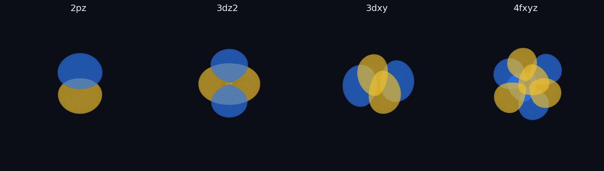
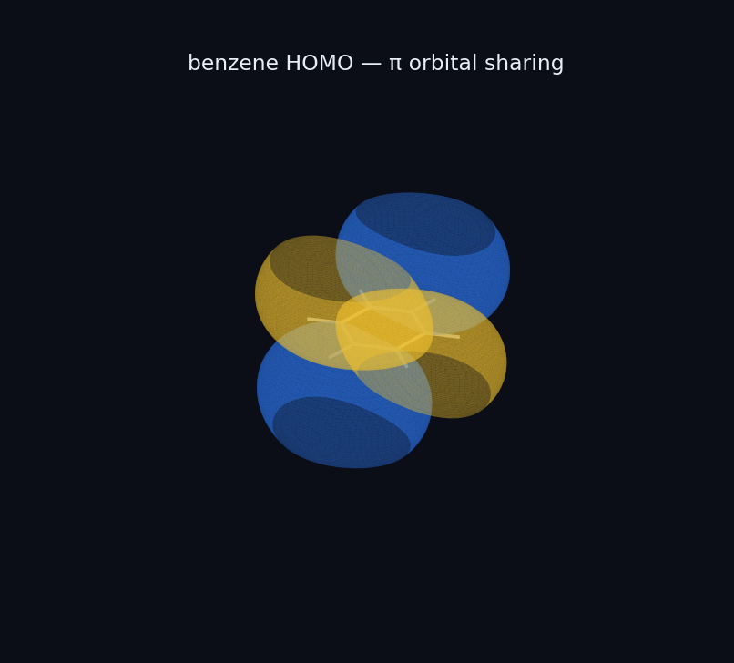
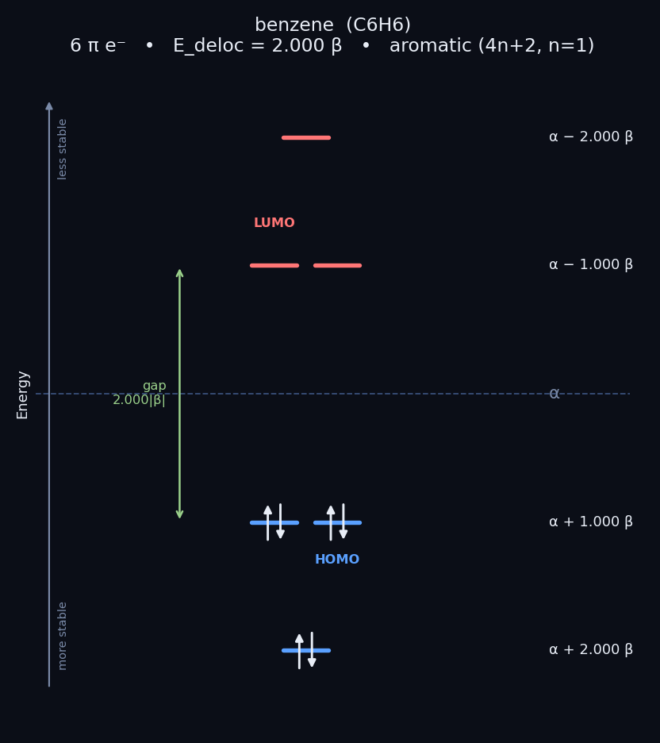
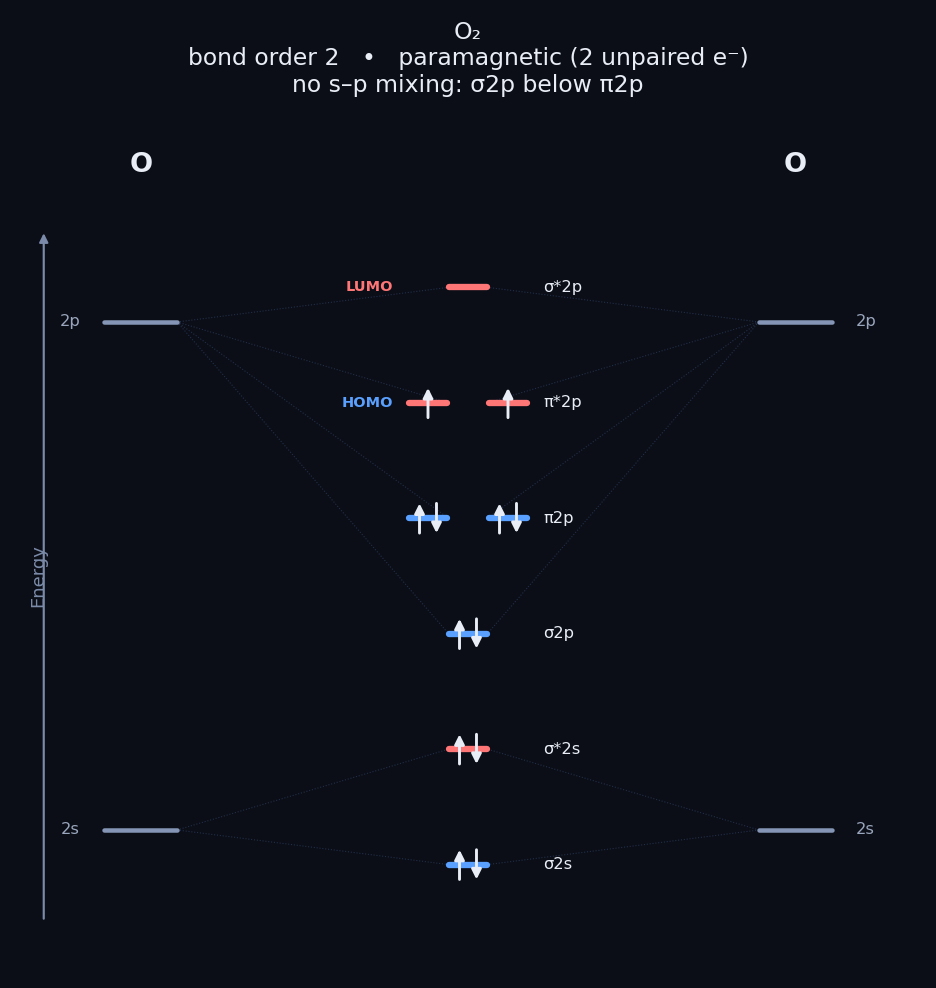

# Orbital Explorer

[](https://github.com/nikshaybisht/orbital-explorer/actions/workflows/ci.yml)
[](LICENSE)
[](https://www.python.org/downloads/)
[](https://github.com/nikshaybisht/orbital-explorer/releases)

3D atomic and molecular orbitals in the browser. I built this while revising undergrad MO theory: hydrogenic AOs you can rotate, Huckel pi systems that show how p orbitals actually share, and diatomic MO diagrams that get O2 paramagnetism right.



> The app is interactive (rotate / zoom). The images above are static previews from the same code.

---

## Try it

| How | Link |
|-----|------|
| **Demo site** | https://nikshaybisht.github.io/orbital-explorer/ |
| **Interactive 2p_z** | https://nikshaybisht.github.io/orbital-explorer/atomic_2pz.html |
| **Run locally (Dash)** | `pip install -r requirements.txt` then `python run_app.py` → http://127.0.0.1:8050 |
| **Run locally (Streamlit)** | `streamlit run streamlit_app.py` |
| **Docker** | `docker build -t orbital-explorer . && docker run --rm -p 8050:8050 orbital-explorer` |

Optional hosted app: [Render](https://render.com/deploy?repo=https://github.com/nikshaybisht/orbital-explorer) or [Streamlit Cloud](https://share.streamlit.io) pointing at `streamlit_app.py`.


---

## What it does

Three tabs:

### 1. Atomic orbitals

Exact hydrogenic solutions of the Schrodinger equation for a one-electron atom:

`ψ(n,l,m) = R_nl(r) · Y_lm(θ,φ)`

Pick `n`, the orbital (s, p, d, f, including labels like `dz2`, `dxy`, `fxyz`), and nuclear charge `Z`. Switch between **phase** (blue/gold ± lobes) and **density** `|ψ|²`.

### 2. Molecular orbitals ("orbital sharing")

Type a name or SMILES (`benzene`, `C=CC=C`, `pyridine`, `allyl cation`, …). The molecule is classified, run through **Huckel theory**, and any MO is drawn in 3D as a linear combination of p orbitals. Same-phase neighbours merge into a bonding region; opposite phase gives a node (antibonding).



### 3. MO diagram and numbers

For a **conjugated** system: Huckel energy ladder with electron filling, HOMO/LUMO, gap, pi-electron count, delocalisation energy, and a simple aromaticity check (4n+2 / 4n).



For a **diatomic** (`O2`, `N2`, `CO`, `NO`, `HF`, `He2`, `B2`, …): the usual AO → MO → AO three-column diagram with bond order, HOMO/LUMO, and magnetism. Includes the s-p mixing switch (π2p below σ2p for Li2 to N2; σ2p below π2p for O2 to Ne2), so **O2 is paramagnetic with two unpaired electrons**. B2 is paramagnetic, C2 is diamagnetic, same as the textbook.



---

## What this is (and is not)

| Part | Method | How serious is it? |
|------|--------|--------------------|
| Atomic orbitals | Analytic hydrogenic wavefunctions (scipy) | **Exact** for H-like atoms. Normalised; correct node counts. |
| Pi MOs | Huckel | **Qualitative.** Matches the usual textbook eigenvalues (ethylene, allyl, butadiene, benzene, cyclobutadiene, …). Energies are in units of β, not kJ/mol. Only conjugated pi systems. |
| Diatomics | Valence AO ladder + Aufbau/Hund | **Qualitative ordering**, but the bond orders and magnetism are the ones you expect for H-Ne diatomics and H-X. |

This is a teaching / revision tool, not ORCA or Gaussian. No SCF, no DFT, no basis sets. That is intentional so it installs with pip and runs on a laptop.

**Not in scope:** sigma frameworks of polyatomics, period-3+ d-block diatomics, ab initio energies. Non-planar conjugated molecules are treated as approximate and flagged.

---

## Install

Python **3.11 to 3.13** (3.11 or 3.12 if you can choose).

```bash
git clone https://github.com/nikshaybisht/orbital-explorer.git
cd orbital-explorer
python -m venv .venv

# Windows PowerShell
.venv\Scripts\Activate.ps1
# macOS / Linux
source .venv/bin/activate

python -m pip install -U pip
pip install -e ".[all]"
python run_app.py
# or: streamlit run streamlit_app.py
```

Open http://127.0.0.1:8050 for the Dash app.

Or just:

```bash
pip install -r requirements.txt
python run_app.py
python -m pytest
```

### Windows and RDKit

RDKit used to be painful on Windows. Current PyPI wheels work on 64-bit CPython 3.11-3.13:

```bash
python -m pip install -U pip setuptools wheel
pip install "rdkit>=2024.3.1"
```

If that still fails:

1. Confirm 64-bit Python from [python.org](https://www.python.org/downloads/) (`python -c "import struct; print(struct.calcsize('P')*8)"` should print `64`).
2. Prefer 3.11 or 3.12.
3. Last resort: `conda install -c conda-forge rdkit`, then install the rest of the deps without re-pulling rdkit.

### Docker

```bash
docker build -t orbital-explorer .
docker run --rm -p 8050:8050 orbital-explorer
```

Molecules worth trying: `benzene`, `naphthalene`, `pyridine`, `C=CC=C`, `[CH2]C=C`, `[CH-]1C=CC=C1`, `O2`, `N2`, `CO`.

---

## Tests

```bash
pip install -e ".[dev]"
python -m pytest
```

39 tests on the actual chemistry: orbital normalisation and orthogonality, node counts, Huckel eigenvalues vs textbook values (benzene `α±β, α±2β`; butadiene `±0.618, ±1.618`), diatomic bond order and magnetism (O2 paramagnetic with 2 unpaired electrons, N2 vs O2 ordering, CO bond order 3).

CI runs on Ubuntu and Windows for Python 3.11 and 3.12.

---

## Layout

```
src/orbital_explorer/
  atomic.py            hydrogenic wavefunctions (s/p/d/f)
  isosurface.py        marching-cubes meshes for 3D plots
  render_atomic.py     Plotly atomic figures
  molecule.py          name/SMILES input (RDKit)
  huckel.py            Huckel solver
  mo_diagram.py        pi MO energy diagram
  render_mo.py         3D LCAO / orbital-sharing view
  diatomic.py          diatomic MO engine
  diatomic_diagram.py  three-column diatomic diagram
  app.py               Dash UI
wsgi.py                gunicorn entry
streamlit_app.py       Streamlit UI (cloud-friendly)
tests/
docs/make_figures.py   rebuilds README images
```

## Version

| Tag | Notes |
|-----|-------|
| **v0.1.0** | First public freeze (license, packaging, CI, Docker, demo site) |

```bash
git checkout v0.1.0
```

See [CHANGELOG.md](CHANGELOG.md) and [Releases](https://github.com/nikshaybisht/orbital-explorer/releases).

## License

[MIT](LICENSE). Use it, fork it, stick it in a lab handout. A star or a link back is appreciated.

## If you teach with this

Pin `v0.1.0` in your handout so the demo does not move under you. Open an issue if a molecule classifies badly or a diagram disagrees with your notes.

## Stack

NumPy, SciPy, scikit-image, RDKit, Plotly, Dash, matplotlib, gunicorn, Streamlit.

## Contributing

See [CONTRIBUTING.md](CONTRIBUTING.md). Fixes that improve the chemistry or the install path are the most useful PRs.
